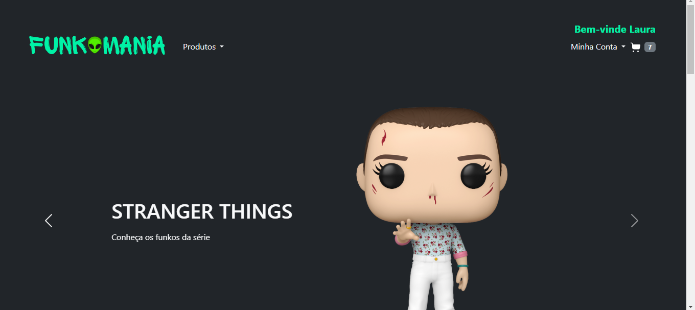
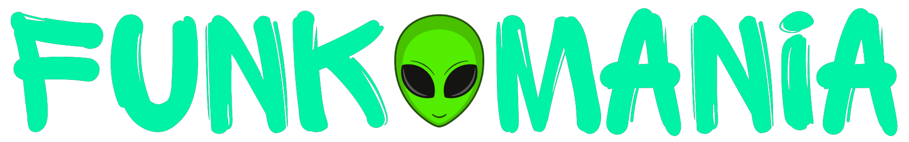

# :alien: FunkoMania

Segundo projeto da disciplina de Programação WEB do curso de Sistemas de Informação - IFSC com foco na construção de site e-commerce, inspirada na <a target="_blank" href="https://funko.com/">Funko Store</a>.

## Instalação

- Xampp (Apache)
- Faça o download do projeto
- A pasta do projeto fica no diretório: xampp/htdocs
- URL de acesso: localhost/[nome da pasta]

## Features

- [x] Cadastro de usuários
- [x] Login e redefinição de senha
- [x] Inclusão de produtos no carrinho
- [x] Carrinho
- [x] Compra de produtos
- [x] Página de pedidos 
- [x] Resumo de pedidos
- [ ] Lupa de pesquisa
- [x] Responsividade

## Tecnologias utilizadas

-  HTML
-  PHP
-  Bootstrap
-  CSS
-  JS
-  VSCode
-  Xampp (apache)

